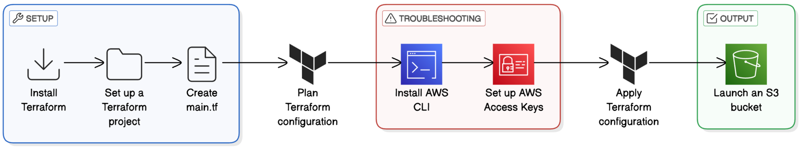

# Create an S3 Bucket with Terraform  
This repo contains a small Terraform configuration that provisions a single, private Amazon S3 bucket with public access blocked. It’s a minimal example of using Infrastructure as Code (IaC) to create secure AWS storage in a repeatable way.



---

## What This Project Does

\- Uses the AWS provider in Terraform

\- Creates one S3 bucket

\- Applies a \`aws\_s3\_bucket\_public\_access\_block\` resource so the bucket:

  - Blocks public ACLs

  - Ignores any public ACLs

  - Blocks public bucket policies

  - Restricts public buckets

\- Outputs the bucket’s domain name after apply

There are no uploads, IAM roles, or advanced policies here on purpose — this is a focused, entry-level infrastructure exercise.

## Why This Matters

Manually creating buckets in the console is fine for one-offs, but it:

\- Is easy to misconfigure (especially security settings)

\- Doesn’t scale across accounts/environments

\- Is hard to review or reproduce

With Terraform, you:

\- Capture the bucket config in code

\- Enforce secure defaults (no public access)

\- Can recreate the same bucket in another region or account with minimal changes

## Prerequisites

To run this yourself, you’ll need:

\- An AWS account

\- AWS credentials configured (via \`aws configure\` or environment variables)

\- Terraform installed (v1.x)

Your IAM user/role should have permissions for:

\- \`s3:CreateBucket\`, \`s3:PutBucket\*\`, \`s3:GetBucket\*\`, \`s3:DeleteBucket\`

\- Any required account-level S3 actions depending on your org policies

## How to Use

1. **Clone the repo and change directory**

   ```
   git clone https://github.com/joeycloudio/terraform-s3-setup.git
   cd terraform-s3-setup```

1.  Set your AWS region (optional) In main.tf, update the region value in the provider "aws" block if you want a different region.
    
2.  Initialize Terraform
    

terraform init

2.  Preview the changes
    

terraform plan

2.  Apply the configuration
    

terraform apply

1.  Type yes when prompted.After apply, Terraform will output the bucket\_domain\_name.
    
2.  Verify in the AWS console
    
    *   Go to the S3 console
        
    *   Confirm the bucket exists with the name in main.tf
        
    *   Check the “Block public access” settings are enabled
        

4.  Destroy when you’re done
    

terraform destroy

1.  This cleans up the bucket so you don’t leave unused resources lying around.
<br>

### **📎 Useful Links**  
📄 **Project Documentation (PDF):** 🔗 [View on LinkedIn](https://www.linkedin.com/feed/update/urn:li:activity:7299317851033583616/)  
📂 **GitHub Repository:** 🔗 [View Code](https://github.com/joeycloudio/terraform-s3-setup/blob/master/main.tf)
